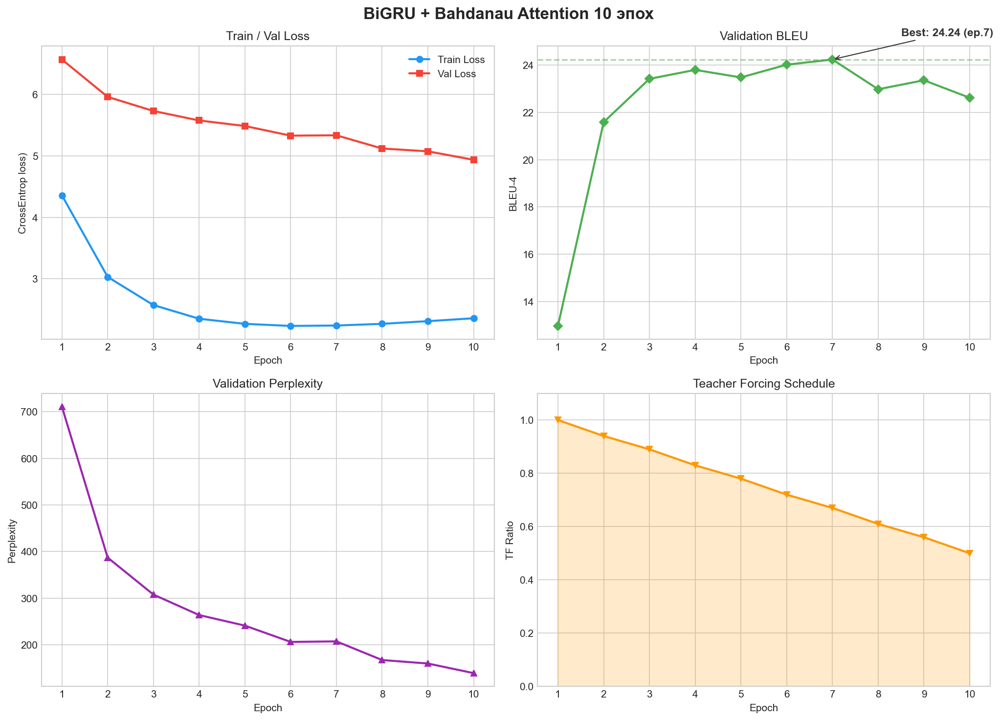
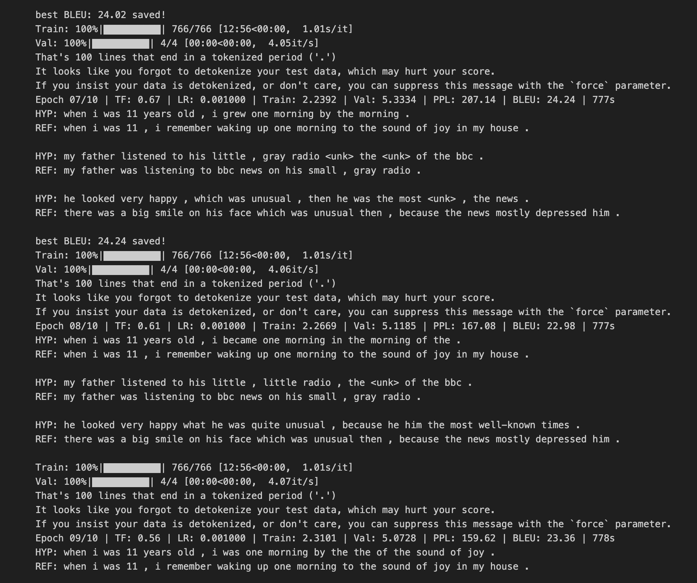
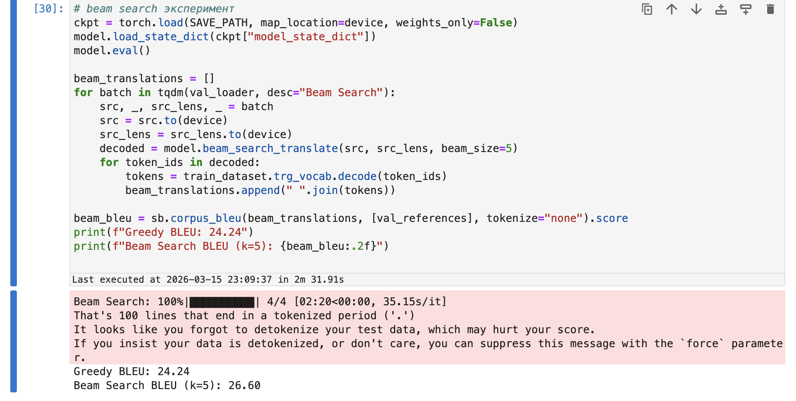
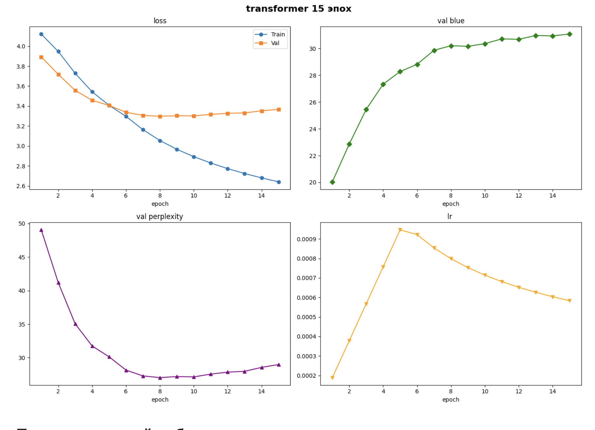
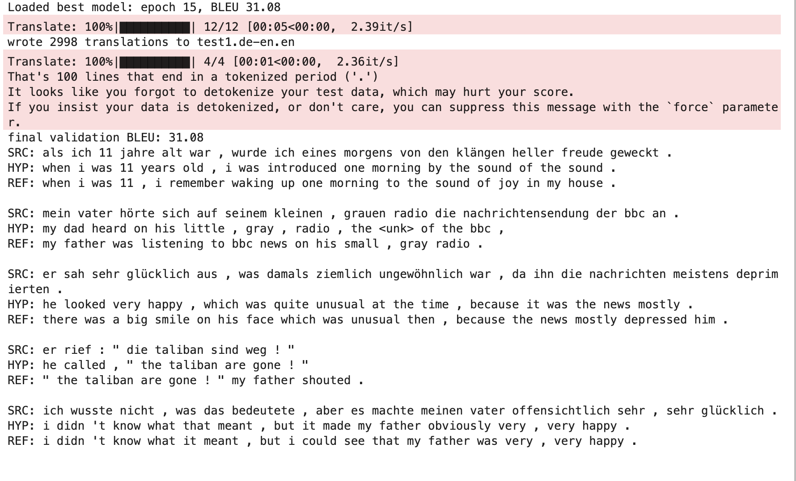
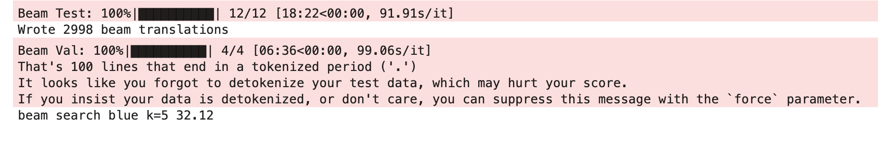
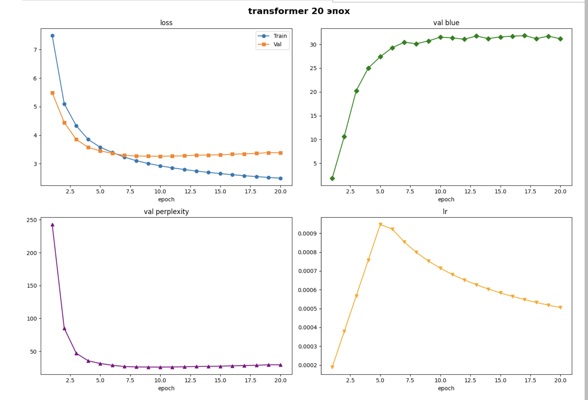
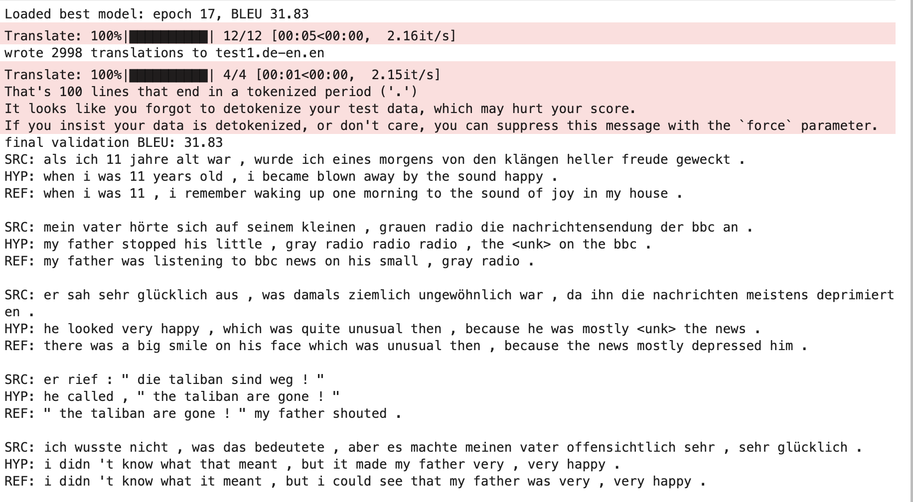
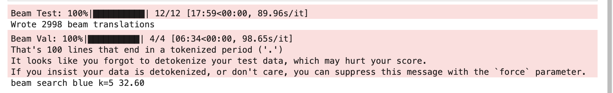

> **Baseline:** [bhw2_gru.ipynb](https://github.com/Ahamidullin/Dl_transformers_rnn/blob/main/bhw2_gru.ipynb)

## 1. Описание архитектуры - baseline

В качестве базовой архитектуры я выбрал модель Seq2Seq с механизмом внимания Bahdanau(additive attention). Выбрал такое сочетание так как эта связка хорошо подходит для данных малого и среднего размеров

### 1.1. Encoder

Кодировщик реализован как двунаправленный GRU- Bidirectional GRU. Я подумал, что лучше чтобы каждое слово знало контекст предыдущего и будещего, так как читает только слева на право. Теперь в обе стороны.
Взял GRU в целом, так как он проще чем lstm, быстрее обучается, не хуже по качеству.

Выходы кодировщика:

- `encoder_outputs` — контекстуализированные представления всех токенов, размерность `hidden_dim × 2`
- `hidden` — финальное скрытое состояние для инициализации декодировщика

### 1.2. Attention

Выбрал Bahdanau attention, так как он изначально был создан для задачи перевода и позволяет декодеру на каждом шаге фокусироваться на нужных словах входного предложения

### 1.3. Decoder

Декодировщик — однонаправленный GRU с attention:

1. Текущий входной токен преобразуется через embedding + dropout
2. На основе скрытого состояния верхнего слоя и выходов энкодера вычисляется контекстный вектор через attention
3. Конкатенация `[embedding, context]` подаётся на вход gru
4. Выход gru, контекстный вектор и embedding конкатенируются для финального предсказания: `fc_out([output, context, embedded])`

Эта схема следует рекомендациям Luong et al. и позволяет модели учитывать как текущий контекст, так и текущее входное слово при генерации.

## 2. Детали обучения

### 2.1. Базовые гиперпараметры

| Параметр | Значение |
|---|---|
| Embedding dim | 256 |
| Hidden dim | 512 |
| Attention dim | 256 |
| Num layers (encoder + decoder) | 2 |
| Dropout | 0.3 |
| Batch size | 256 |
| Epochs | 10 |
| Optimizer | Adam |
| Learning rate | 1e-3 |
| LR scheduler | ReduceLROnPlateau (factor=0.5, patience=3) |
| Gradient clipping | 1.0 |
| Teacher forcing | линейно: 1.0 → 0.5 |
| Декодирование | Greedy (argmax) |

### 2.2. Teacher Forcing

Я решил использовать teacher forcing для того, чтобы снизить проблему накопления ошибки пресдказания следующего слова. Я поставил показатель Teacher forcing ratio = 1 в самом начале. Но тогда, возникает  разрыв между условиями обучения и инференса - exposure bias и чтобы это сгладить я уменьшаю показатель до 0.5, чтобы она видела свои предсказания и привыкала к ним.

## 3. Эксперименты

### Baseline

#### Логи

| Epoch | TF | Train Loss | Val Loss | PPL | BLEU |
|---|---|---|---|---|---|
| 1 | 1.00 | 4.3571 | 6.5666 | 710.98 | 12.96 |
| 2 | 0.94 | 3.0297 | 5.9585 | 387.02 | 21.59 |
| 3 | 0.89 | 2.5719 | 5.7290 | 307.66 | 23.42 |
| 4 | 0.83 | 2.3494 | 5.5746 | 263.64 | 23.80 |
| 5 | 0.78 | 2.2665 | 5.4847 | 240.99 | 23.48 |
| 6 | 0.72 | 2.2326 | 5.3278 | 205.99 | 24.02 |
| **7** | **0.67** | **2.2392** | **5.3334** | **207.14** | **24.24** |
| 8 | 0.61 | 2.2669 | 5.1185 | 167.08 | 22.98 |
| 9 | 0.56 | 2.3101 | 5.0728 | 159.62 | 23.36 |
| 10 | 0.50 | 2.3574 | 4.9343 | 138.97 | 22.62 |

Best BLEU: 24.24 на эпохе 7

Train loss стабильно снижается с 4.36 до 2.36. Val loss тоже уменьшается, но разрыв с train loss большой — модель переобучается. BLEU достигает пика на эпохе 7  и затем немного снижается, видимо из-за снижения teacher forcing ratio.

#### Примеры переводов

Модель хорошо справляется с простыми предложениями. но есть проблемы: потеря смысла в длинных предложениях как в примере 1 и перестановка структуры как в примере 2

### Эксперимент 2: Beam Search декодирование

Greedy декодирование выбирает самое лучшее слово локально на каждом шаге, но это не гарантирует что оно лучшее глобально. Попробую это исправить с beam search, который  рассматривает несколько гипотез одновременно.

Реализован beam search с `beam_size = 5`.Нормализация длины предотвращает смещение в сторону коротких переводов.

будем применять уже к обученной модели на эксперементе 1

| Декодирование | Val BLEU | Δ BLEU |
|---|---|---|
| Greedy | 24.24 | — |
| Beam Search (k=5) | **26.60** | **+2.36** |

Beam search дал +2.36 blue без переобучения. Значит, greedy декодировщик правда имел проблему с застриванием в локальном оптимуме.

### Переход на Transformer

GRU-модель ограничена последовательной обработкой и достигла потолка где BLEU примерно 26 с beam search. Перешёл на архитектуру Transformer (Vaswani et al., 2017), которая использует multi-head self-attention и позволяет параллельную обработку.

| Параметр | Значение |
|---|---|
| d_model | 256 |
| Головы | 8 |
| Слои (enc + dec) | 3 + 3 |
| FFN | 512 |
| Dropout | 0.1 |
| Label smoothing | 0.1 |
| LR schedule | Noam warmup (4000 шагов) |

#### Графики обучения

Train loss снижается достаточно стабильно. Val loss выходит на плато после примерно 6 эпохи. BLEU растёт до 31+ к 15 эпохе. Learning rate сначала растёт, потом плавно снижается.

#### Примеры переводов

видно что качество переводов значительно улучшилось, предложения стали более грамматичные и точнее передают смысл по сравнению с GRU

### Эксперимент 3: Beam Search + трансформер

мотивация : как и в rnn попробуем использовать beam search, так как мы на каждом шаге в процессе авторегрессионного режима будем предсказываит не одно слово (токен), а к лучших слов, для того чтобы уменьшить накоп ошибки. Так же у rnn это дало улучшение метрики.

| Декодирование | Val BLEU | Δ BLEU |
|---|---|---|
| Greedy | 31.08 | — |
| Beam Search (k=5) | **32.12** | **+1.04** |

Как видно, улучшение так же присутсвуетх

### Эксперимент 4: Увеличение D_FF и числа эпох

Мотивация: в оригинальной статье (Vaswani et al.) используется D_FF = 4 × d_model. Попробуем увеличить D_FF с 512 до 1024 (4×256) и количество эпох с 15 до 20 для дальнейшего улучшения качества.

| Параметр | Было | Стало |
|---|---|---|
| D_FF | 512 (2×) | 1024 (4×) |
| NUM_EPOCHS | 15 | 20 |

#### Графики обучения

#### Примеры переводов

Val BLEU вырос незначительно с 31.08 до 31.83, лучшее значение на эпохе 17, однако на публичной тестовой выборке результат стал чуть хуже. Это значит что трансформер переобучился.

Beam search (k=5) на этой модели так же не помог превзойти базовый конфиг:

На публичном тесте: 29.01 (vs 29.03 у базового конфига + beam search). Вывод: увеличение ёмкости модели без увеличения объёма данных ведёт к переобучению.

## 4. Сводная таблица результатов

| # | Эксперимент | Val BLEU | Примечания |
|---|---|---|---|
| 1 | GRU Baseline (Greedy) | 24.24 | Best на эпохе 7 |
| 2 | GRU + Beam search (k=5) | 26.60 | +2.36, без переобучения |
| 3 | Transformer (Greedy) | 31.08 | Best на эпохе 15 |
| 4 | Transformer + Beam search (k=5) | **32.12** | +1.04, без переобучения |
| 5 | Transformer (D_FF=1024, 20 эпох) | 31.83 | Переобучение, результат на тесте хуже |
| 6 | Transformer v2 + Beam search (k=5) | 32.87 | Публичный тест 29.01, хуже базового |

## 5. Литература

1. Bahdanau D., Cho K., Bengio Y. "Neural Machine Translation by Jointly Learning to Align and Translate." ICLR, 2015.
2. Cho K. et al. "Learning Phrase Representations using RNN Encoder-Decoder for Statistical Machine Translation." EMNLP, 2014.
3. Luong M., Pham H., Manning C. "Effective Approaches to Attention-based Neural Machine Translation." EMNLP, 2015.
4. Vaswani A. et al. "Attention Is All You Need." NeurIPS, 2017.
